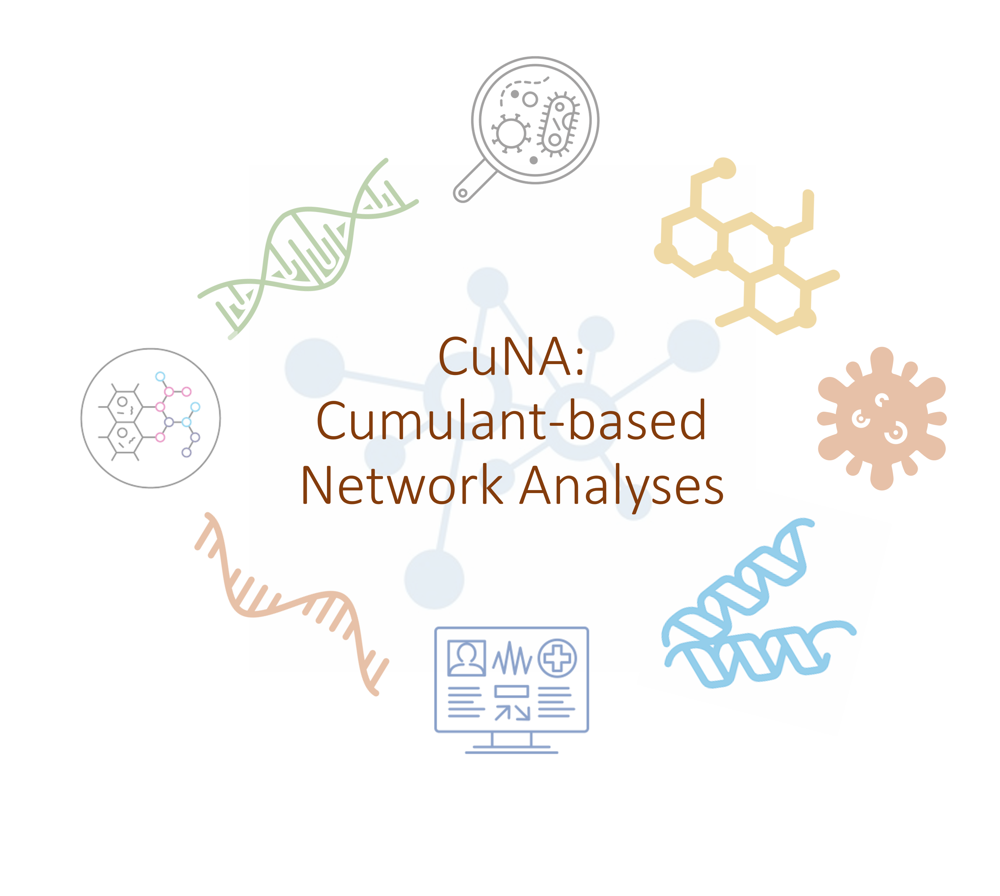
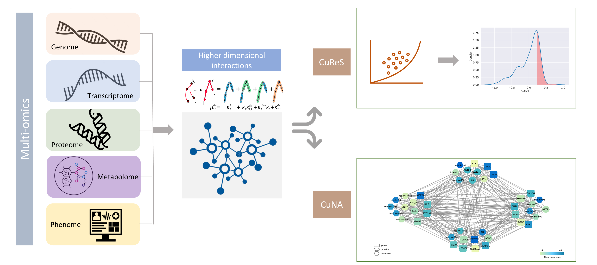

CuNA
============



Complex diseases are characterized by their intricate etiology, combining a variety of factors and spanning a diverse set of omics data types. To obtain insights on disease subtypes, biomarkers associated with them,and predict disease states, we need to integrate and analyze multiomics data. Here, we propose a cumulant-based network analysis toolkit (*CuNA*) which finds higher-order interactions between multiomics variables and identify disease subtypes, discover biomarkers, visualize them in an interactive dashboard, and provide a novel method to compute cumulant-based risk scores (*CuRES*) from multiomics data.


Framework
----------


Input 
^^^^^^^^^^^^^^
CuNA takes a csv file as input with the features in columns and samples in rows (see `./docs/data/tcga_mixomics_new_train_forcuna.csv`). It is multithreaded and takes an argument for number of threads. 

Output 
^^^^^^^^^^^^^^
cd 
CuNA outputs three components: 

Networks 
----------
a) Network file with three columns, `v1`,`v2`,`count`, corresponding to two vertices and the interaction/edge term between them. 
b) A file with the communities corresponding to the features. 
c) A file with the node rank (importance of node)

CuRES
----------
A risk score called *CuRES* computed from multi-omics data.


CuNAviz
----------
An interactive visualizer, *CuNAviz* can be executed from 

1. `_CuNAviz example 1 <https://rawcdn.githack.com/BiomedSciAI/Geno4SD/blob/cuna/docs/data/cunaviz_False_25.html>`_
2. `_CuNAviz example 2 <https://rawcdn.githack.com/BiomedSciAI/Geno4SD/blob/cuna/docs/data/cunaviz_False_50.html>`_
3. `_CuNAviz example 3 <https://rawcdn.githack.com/BiomedSciAI/Geno4SD/blob/cuna/docs/data/cunaviz_True_25.html>`_
4. `_CuNAviz example 4 <https://rawcdn.githack.com/BiomedSciAI/Geno4SD/blob/cuna/docs/data/cunaviz_True_50.html>`_

Usage 
-------
See `tutorial <https://github.com/BiomedSciAI/Geno4SD/blob/main/tutorials/CuNA.ipynb>`_

Contact 
-------
```
Aritra Bose (a dot bose at ibm dot com)
```

Citation
--------

Please cite the following article if you use CuNA: *Bose, A., Platt, D. E., Haiminen, N., & Parida, L. (2021). CuNA: Cumulant-based Network Analysis of genotype-phenotype associations in Parkinson’s Disease. medRxiv, 2021-08.*
