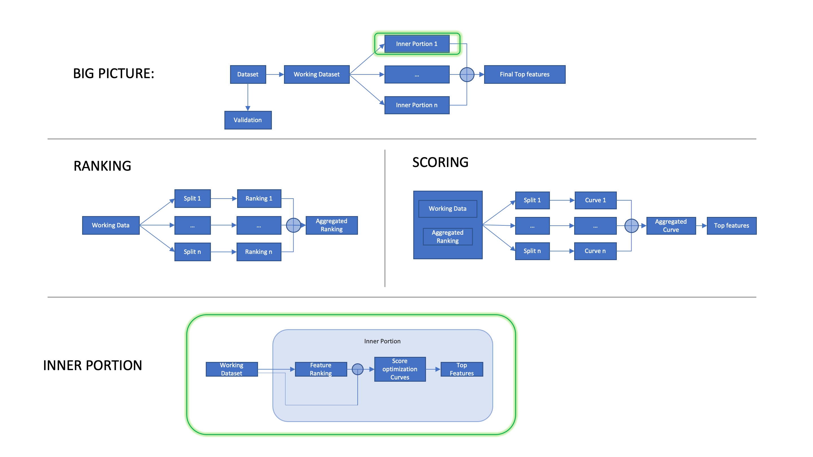

RubricOE
============

	
Method
-------

rubricOE is a machine learning framework, implementated in python, with error bar computations to obtain interpretable genetic and non-genetic features from genomic or transcriptomic data combined with clinical factors in the form of electronic health records. 

This is a schematic view of rubricoe’s processing flow

The entire rubricOE pipeline can be executed by:

.. autosummary::
    ~geno4sd.ml_tools.rubricoe.rubricoe.compute

Alternative RubricOE can be exectude using the available API:

.. autosummary::
    ~geno4sd.ml_tools.rubricoe.rubricoe.compute_curves
    ~geno4sd.ml_tools.rubricoe.rubricoe.compute_feature_counts
    ~geno4sd.ml_tools.rubricoe.rubricoe.compute_top_features

An example can be found in this  `tutorial <https://github.ibm.com/ComputationalGenomics/Geno4SD/blob/main/tutorials/RubricOE.ipynb>`_

Citation
--------

Please cite the following article if you use RubricOE:
